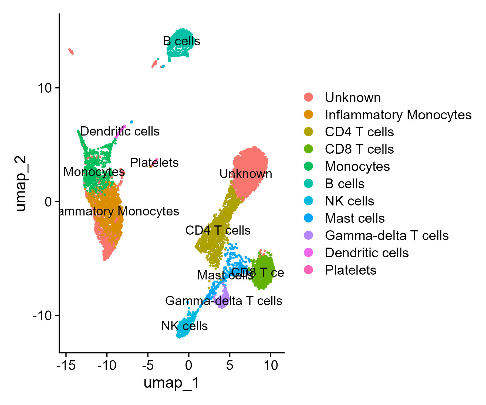

# PBMC scRNA-seq Analysis (Seurat)

This project implements a complete single-cell RNA-seq (scRNA-seq) analysis pipeline on human peripheral blood mononuclear cells (PBMCs) using Seurat (R). It utilizes publicly available data from 10x Genomics and demonstrates a reproducible and structured approach to analyzing single-cell transcriptomic data.

## Workflow
1. Data loading and QC
2. Normalization and feature selection
3. Clustering and dimensionality reduction
4. Marker identification and cell type annotation

## Structure
- `scripts/` → analysis scripts
- `results/` → figures and tables
- `data/` → raw data (ignored in Git)
  
## Results
The analysis successfully identified major immune cell populations, including CD4+ and CD8+ T cells, B cells, NK cells, monocytes, dendritic cells, and platelets. Clustering and marker-based annotation revealed clear separation of these cell types in UMAP space, demonstrating the effectiveness of the workflow.
The annotated UMAP visualization below illustrates the distinct clustering of major immune cell populations:

## Biological Interpretation
The clustering patterns observed in the UMAP reflect known biological organization of human PBMCs. Distinct adaptive immune populations (CD4+ and CD8+ T cells, B cells) are clearly separated from innate immune populations (monocytes, dendritic cells, NK cells), consistent with their functional roles.
Monocytes and inflammatory monocytes form closely related clusters, indicating shared transcriptional programs with activation-specific differences. Dendritic cells appear as a distinct population, reflecting their specialized antigen-presenting function.
The identification of platelet clusters and smaller populations such as mast cells and gamma-delta T cells further highlights the sensitivity of the workflow in detecting both abundant and rare immune cell types.

## Tools
- R
- Seurat
- ggplot2

## Author
Abdulrasheed Buhari
